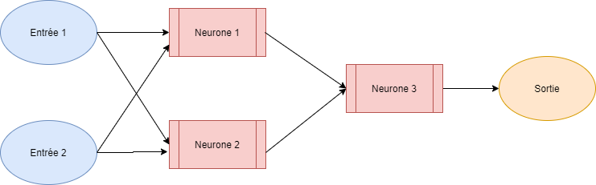
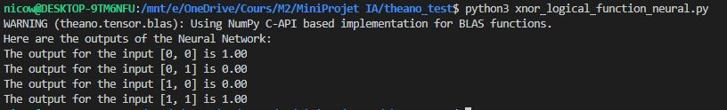

# Prise en main de Theano

## _Exemple de création d'un réseau de neurones double couche_
<br>

Afin d'appréhender la prise en main de la librairie avec un exemple concret, nous allons ici créer un réseau de neurones à deux couches, dont le but est l'apprentissage de la fonction logique XNOR.
On rappelle tout d'abord la table de vérité de la fonction XNOR:  

| Entrée 1 | Entrée 2 | Sortie |
|:-:|:-:|:-:|
| 0 | 0 | 1 |
| 0 | 1 | 0 |
| 1 | 0 | 0 |
| 1 | 1 | 1 |
<br>

Nous allons ici réaliser un apprentissage supervisé d'un réseau à plusieurs couches. Ce réseau est défini de la façon suivante:

<br>



<br>
<br>

De ce diagramme, on peut définir la table de vérité en fonction des neurones:

| Entrée 1 | Entrée 2 | Neurone 1 | Neurone 2 | Neurone 3 | Sortie |
|:-:|:-:|:-:|:-:|:-:|:-:|
| 0 | 0 | 1 | 0 | 1 | 1 |
| 0 | 1 | 0 | 0 | 0 | 0 |
| 1 | 0 | 0 | 0 | 0 | 0 |
| 1 | 1 | 0 | 1 | 1 | 1 |
<br>

L'étude préliminaire étant terminée, nous allons désormais pouvoir passer à l'implémentation. Le code source au complet est disponible dans le fichier: `theano_test/xnor_logical_function_neural.py`  

Commençons par importer les différentes librairies nécessaires à la création d'un réseau de neurones.

```python
# Imports
import theano
import theano.tensor
from theano import function

from random import random
import numpy
```

Afin d'utiliser Théano, il est nécessaire d'importer la librairie. On importe également theano.tensor, qui permet l'accès à des types (matrix, scalar, ...) et des méthodes de calculs (exp, dot, log, ...) compatibles avec theano. Les functions theano sont également nécessaire au bon fonctionnement du projet. Enfin, on importe numpy et random, afin de faciliter la manipulation de données.  

```python
# Variables Definition
inputMatrix = theano.tensor.matrix('inputMatrix')

weight1 = theano.shared(numpy.array([random(), random()]))
weight2 = theano.shared(numpy.array([random(), random()]))
weight3 = theano.shared(numpy.array([random(), random()]))

bias1 = theano.shared(1.)
bias2 = theano.shared(1.)

learningRate = 0.01
iterationNumber = 100000
```

Définissons les variables qui vont nous être nécessaires. Tout d'abord, l'entrée de notre réseau de neurones est une matrice de dimension deux. Elle contient les différents couples de valeurs possibles.  
Ensuite, on définit plusieurs variables de type shared. Ces variables sont partagées par les différents appels des fonctions Théano, et permettent de convertir directement depuis des types Python. On définit ici les poids correpondants aux trois neurones, ainsi que les deux biais des deux couches.
(Plus d'infos sur les types ajoutés par Théano [ici](https://theano.readthedocs.io/en/rel-0.6rc3/library/tensor/basic.html))  
Nous définissons également le taux d'apprentissage en float, ainsi qu'un entier représentant le nombre d'itérations pour l'apprentissage.

```python
# Variables Definition
neuron1 = 1/(1 + theano.tensor.exp( -theano.tensor.dot(inputMatrix, weight1) - bias1))
neuron2 = 1/(1 + theano.tensor.exp( -theano.tensor.dot(inputMatrix, weight2) - bias1))
firstLayerResulMatrix = theano.tensor.stack([neuron1, neuron2], axis=1)

neuron3 = 1/(1 + theano.tensor.exp( -theano.tensor.dot(firstLayerResulMatrix, weight3) - bias2))
```

Il est maintenant temps de définir nos neurones. pour chacune des neurones, on utilise la formule suivante:  

<br>


<br>
Notons qu'il nous est alors nécessaire de définir une matric temporaire entre les deux couches du réseau de neurone, afin de pouvoir appliquer la même formule à la troisième neurone.

```python
# Gradient Definition
realOutput = theano.tensor.vector('realOutput')
cost = -(realOutput*theano.tensor.log(neuron3) + (1 - realOutput)*theano.tensor.log(1-neuron3)).sum()
gradWeight1, gradWeight2, gradWeight3, gradBias1, gradBias2 = theano.tensor.grad(cost, [weight1, weight2, weight3, bias1, bias2])
```

Nous définissons ici un vector, nommé realOutput, qui correspond à l'output attendu à la sortie du réseau. Nous créons également la formule de calcul du coût pour ce réseau de neurones. Enfrin, grâce à cette formule, nous calculons les gradients des différents poids et des deux biais.

```python
# Weight and Bias update
TrainingFunction = function(
    inputs = [inputMatrix, realOutput],
    outputs = [neuron3, cost],
    updates = [
        [weight1, weight1-learningRate*gradWeight1],
        [weight2, weight2-learningRate*gradWeight2],
        [weight3, weight3-learningRate*gradWeight3],
        [bias1, bias1-learningRate*gradBias1],
        [bias2, bias2-learningRate*gradBias2]
    ]
)
```

Ici, nous définissons la fonction principale du projet. Il s'agit d'une Théano function. Nous lui donnons deux entrées, ici la matrice d'entrée ainsi que la sortie attendue. Nous lui donnos également les sorties attendues: le résultat du calcul de la troisième neurone, ainsi que le coût de l'itération.
Enfin, on définit les updates des différents poids et biais.

```python
# Inputs and Outputs Definition
inputs = [
    [0, 0],
    [0, 1],
    [1, 0],
    [1, 1]
]

outputs = [1, 0, 0, 1]
```

Nous définissons ici la matrice d'input initiale, qui est associée à l'objet inputMatrix déclaré précédemment. Comme il s'agit d'un entrainement supervisé, nous déclarons également les résultats attendus pour chaque couple de valeurs.

```python
# Model Training
costArray = []
for index in range(iterationNumber):
    predictionArray, iterationCost = TrainingFunction(inputs, outputs)
    costArray.append(iterationCost)
```

C'est ici que débute l'entrainement de notre réseau. On définit une costArray, qui nous permettra de conserver le coût de cha que opération. Ce n'est pas une étape obligatoire, mais il peut être utile de conserver le coût afin d'étudier l'entrainement de notre réseau.
Ensuite, on applique la Theano function, que nous avons défini précedemment, à notre matrice d'entrée, autant de fois qu'indiqué par notre variable iterationNumber.

```python
# Output Printing
print('Here are the outputs of the Neural Network:')
for index in range (len(inputs)):
    print('The output for the input [%d, %d] is %.2f' % (inputs[index][0], inputs[index][1], predictionArray[index])) 
```

Après écriture du script d'affichage et exécution du fichier python, on obtient le résultat suivant dans la console:



Nous avons ainsi appris les bases de l'utilisation de Théano, et savons désormais entrainer un réseau de neurone à plusieurs couches.
